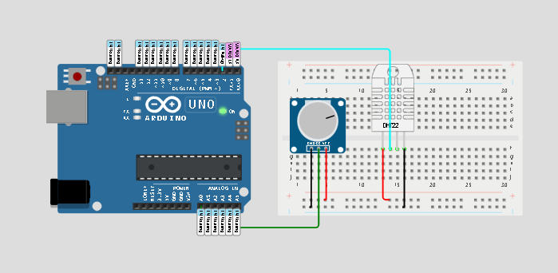

  <h1>Hc Gaming</h1>

  <a href="#pushpin-Descrição">Descrição</a>&nbsp;&nbsp;&nbsp;|&nbsp;&nbsp;&nbsp;
  <a href="#pushpin-Componentes">Componentes Utilizados</a>&nbsp;&nbsp;&nbsp;|&nbsp;&nbsp;&nbsp;
  <a href="#pushpin-Plataformas">Plataformas  Utilizadas</a>&nbsp;&nbsp;&nbsp;|&nbsp;&nbsp;&nbsp;
  <a href="#pushpin-Codigo">Código Arduino</a>&nbsp;&nbsp;&nbsp;|&nbsp;&nbsp;&nbsp;
  <a href="#pushpin-Fluxo">Fluxo dos Dados</a>&nbsp;&nbsp;&nbsp;|&nbsp;&nbsp;&nbsp;
  <a href="#pushpin-Conclusão">Conclusão</a>&nbsp;&nbsp;&nbsp;|&nbsp;&nbsp;&nbsp;
  <a href="#smile-Integrantes">Integrantes</a>&nbsp;&nbsp;&nbsp;|&nbsp;&nbsp;&nbsp;

## :pushpin: Descrição

Este projeto foi realizado na [FIAP](https://www.fiap.com.br/) e visa monitorar e visualizar dados de temperatura, umidade e batimentos cardíacos usando um Arduino UNO, um sensor DHT11, um sensor de batimentos cardíacos e as plataformas TagoIO e Wokwi. Os dados são enviados para o TagoIO, onde são visualizados em dashboards personalizados.

## :pushpin: Componentes Utilizados

- Arduino UNO
- Sensor DHT11 (Temperatura e Umidade)
- Sensor de Batimentos Cardíacos
- Placa de prototipagem (Breadboard)
- Resistores e cabos jumper

## :pushpin: Plataformas Utilizadas

[Wokwi:] Para simulação do Arduino e seus componentes.
[TagoIO:] Para conexão, envio e visualização dos dados em dashboards.
[ArduinoIDE] 

## :pushpin: Código Arduino

O código Arduino é responsável por ler os dados dos sensores, formatá-los em JSON e enviá-los via serial.

#include <DHT.h>
#include <ArduinoJson.h>
 
#define DHTTYPE DHT11   
 
const int pinDHT = 2;        
const int pinHeartRate = A0;
 
DHT dht(pinDHT, DHTTYPE);
 
void setup() {
  Serial.begin(9600);
  dht.begin();
}
 
void loop() {
  float temperature = dht.readTemperature(); 
  float humidity = dht.readHumidity();       
  int heartRateValue = analogRead(pinHeartRate);
 
  float heartRate = map(heartRateValue, 0, 1023, 60, 100);
 
  if (isnan(temperature) || isnan(humidity)) {
    Serial.println("Failed to read from DHT sensor!");
    return;
  }
 
  StaticJsonDocument<200> doc;
  doc["temperature"] = temperature;
  doc["humidity"] = humidity;
  doc["heart_rate"] = heartRate;
 
  serializeJson(doc, Serial);
  Serial.println();
 
  delay(2000);
}

## :pushpin: Fluxo dos Dados 

Os dados são enviados do Arduino para o Node-RED, que os processa e encaminha para o TagoIO.

Os dados são visualizados em dashboards no TagoIO para monitoramento em tempo real.

## :pushpin: Conclusão

Este projeto demonstra a integração entre Arduino, Node-RED e TagoIO para monitoramento remoto de dados ambientais e de saúde. As plataformas utilizadas permitem uma visualização clara e acessível dos dados coletados, facilitando o monitoramento em tempo real.

## :smile: Integrantes

- [Felipe Schneider - RM552643](https://github.com/felpschneider)
- [Hugo Santos - RM553266](https://github.com/ThiagoAraujot/CP1-WebDevelopment/commits?author=guguim)
- [Maria Julia Araujo Rodrigues - RM553384](https://github.com/majuaraujo)
- [Thiago Araujo Vieira - RM553477](https://github.com/ThiagoAraujot)
- [Vinicius Centurion - RM554063](https://github.com/vinicenturion)

###### Clique no nome para visitar o GitHub
